This page contains a step-by-step guide through the installation of CentOS 7 and CLion.

### Install VMWare Player (or Fusion)

Not currently covered by this guide.


### Installing CentOS 7

**Step 0:** Download CentOS.  A link to the installation ISO is provided 
on the [Resources](index.md) page.

**Step 1:** Boot Virtual machine from CentOS installation media.  
Select the "Install CentOS 7" option and press "Enter"
<br>
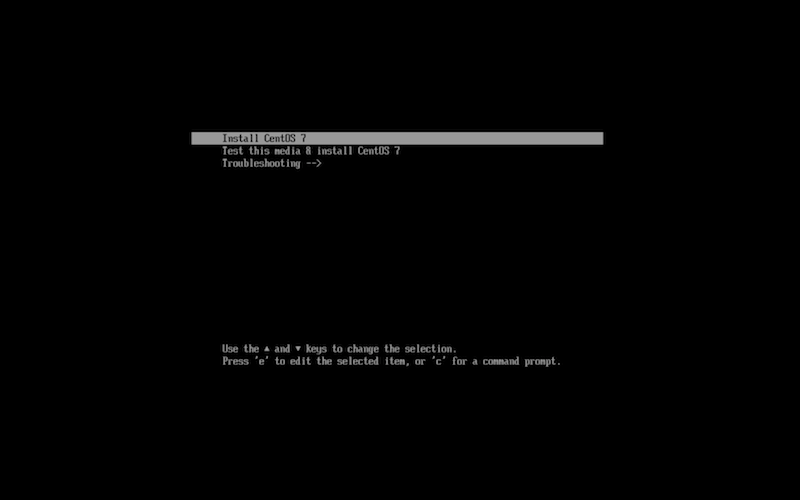

<hr><!-- =============================================================== -->

**Step 2:** Select your language and click "Continue"
<br>
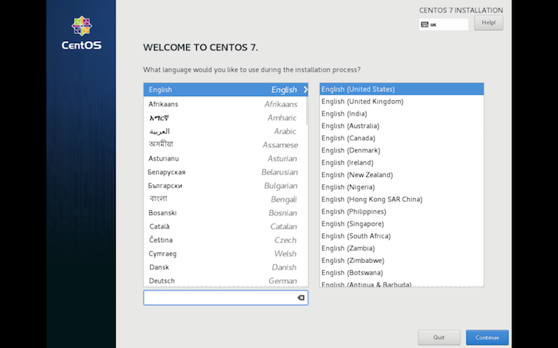

<hr><!-- =============================================================== -->

**Step 3:** Click on "Software Selection" on right side.
<br>
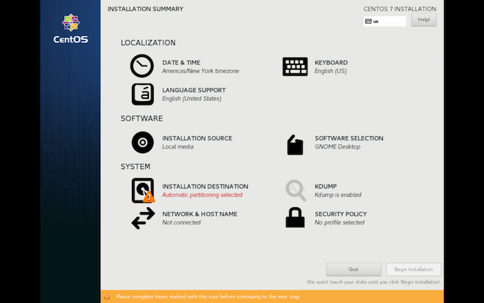

<hr><!-- =============================================================== -->

**Step 4:** In the left-hand pane, select the "GNOME Deskop".
<br>
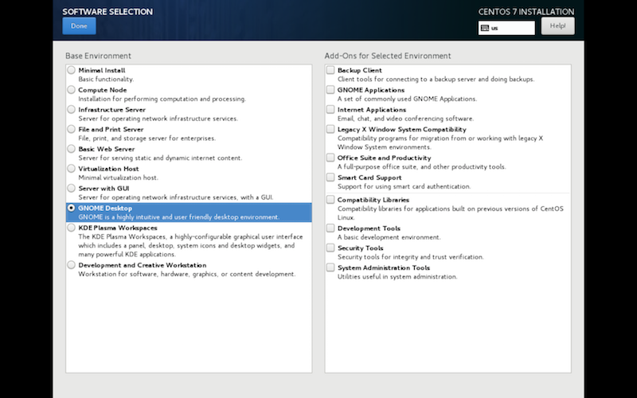

<hr><!-- =============================================================== -->

**Step 5:** In the right-hand pane, scroll down and select "Development Tools".
Click "Done" in the top left-hand corner.
<br>
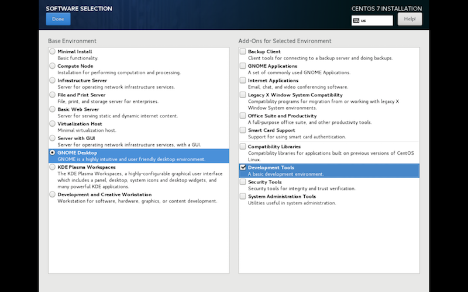

<hr><!-- =============================================================== -->

**Step 6:** Click on "Installation Destination". It will likely have warning icon overlay.
<br>


<hr><!-- =============================================================== -->

**Step 7:** Click on your virtual hard disk drive to highlight it.
 Click it a second time to select it as the installation destination.
 Make sure your virtual hard disk drive is selected **and has a checkmark**. 
 Leave the "Partitioning" option set to "Automatically configure partitioning".
 Click "Done" in the top left-hand corner.
<br>
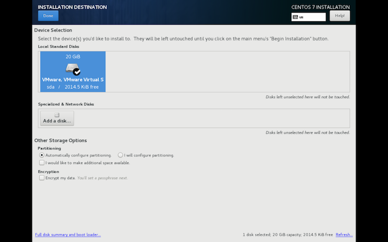

<hr><!-- =============================================================== -->

**Step 8:** Verify that the warning overlay has disappeared from the "Installation Destination". 
 Under "Installation Destination" you should also see "Automatic partitioning selected". 
<br>


<hr><!-- =============================================================== -->

**Step 9:** Click on "Network & Host Name".
<br>
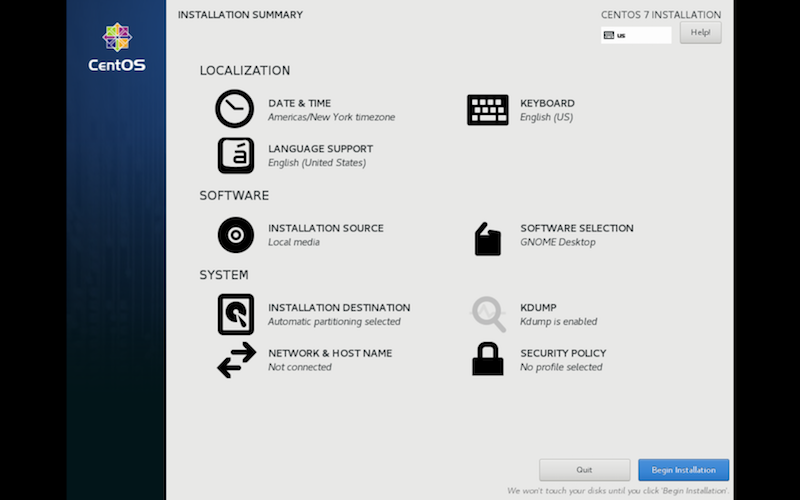

<hr><!-- =============================================================== -->

**Step 10:** Verify that you have an Ethernet adapter selected in the left-hand pane.
<br>
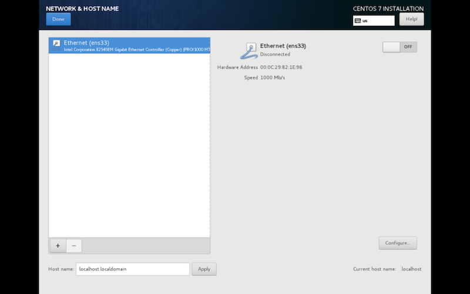

<hr><!-- =============================================================== -->

**Step 11:** Click the ON/OFF toggle in the top right to enable your Ethernet adapter.
Click "Done" in the top left-hand corner.
<br>
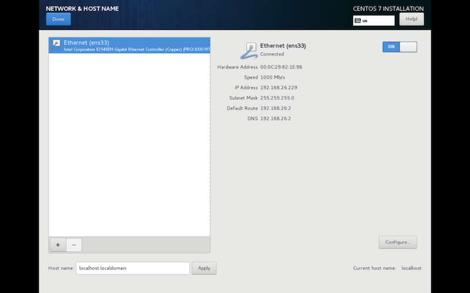

<hr><!-- =============================================================== -->

**Step 12:** Click "Being Installation".
<br>
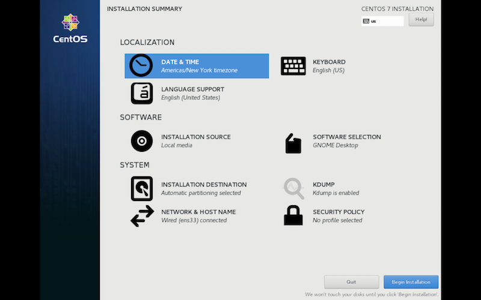

<hr><!-- =============================================================== -->

 **Step 13:** Click on "Root Password".
<br>


<hr><!-- =============================================================== -->

**Step 14:** Set a root password (REMEMBER THIS PASSWORD!!!)
Click "Done" in the top left-hand corner.
<br>
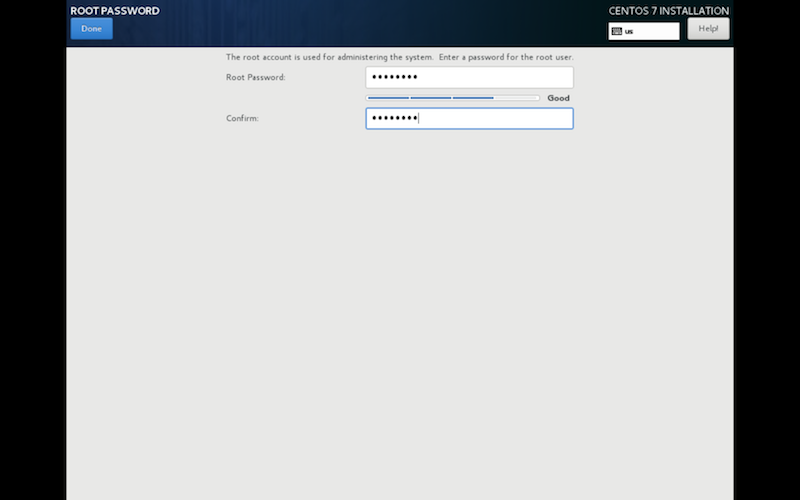

<hr><!-- =============================================================== -->

**Step 15:** Click "User Creation"
<br>
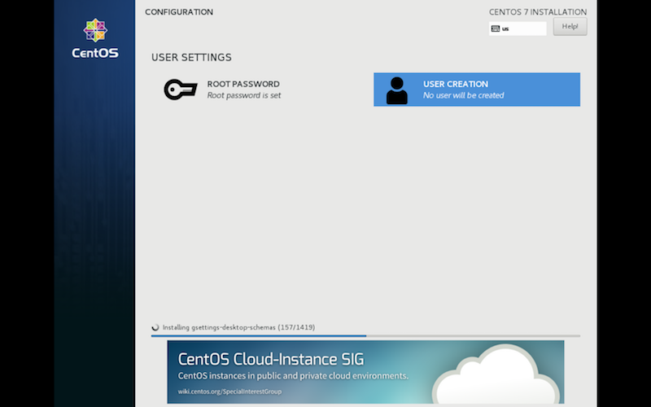

<hr><!-- =============================================================== -->

**Step 16:** Type in your preferred username and password. 
This password need not be the same as the root password previously set.
Click "Done" in the top left-hand corner.
<br>
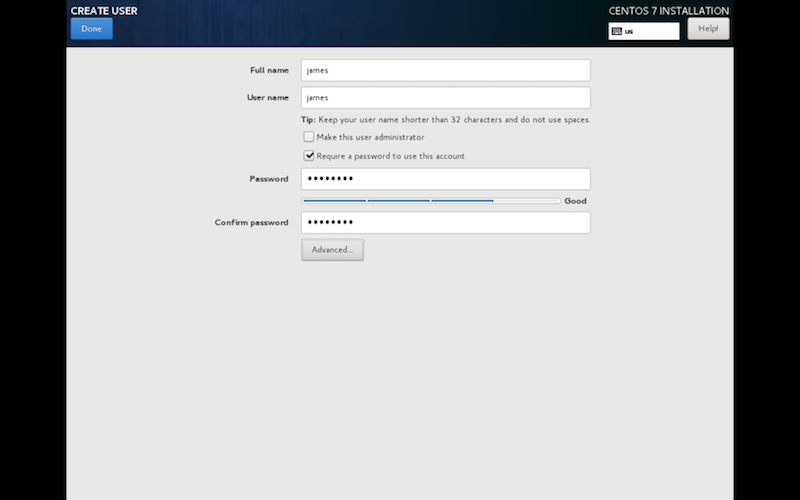

<hr><!-- =============================================================== -->

**Step 17:** Wait patiently while the OS installs.
<br>
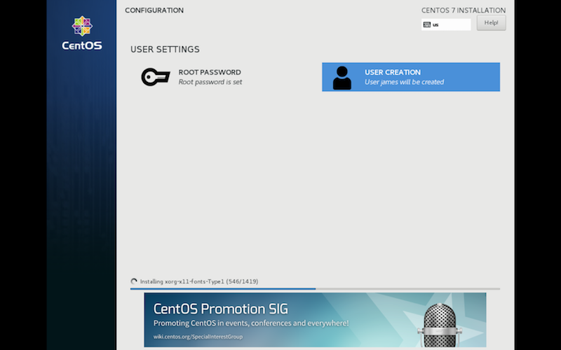

<hr><!-- =============================================================== -->

**Step 18:** When the installation is complete, click the "Reboot" button.
<br>
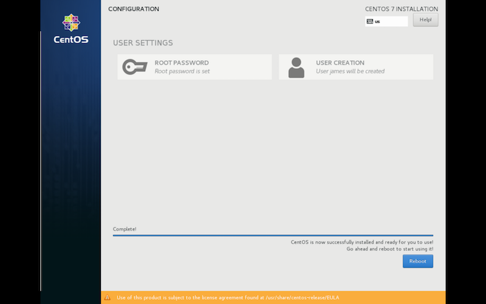

<hr><!-- =============================================================== -->

**Step 19:** During reboot, select the first CentOS option. Don't worry if
the screen times out and you miss it -- it's the default selection.
<br>
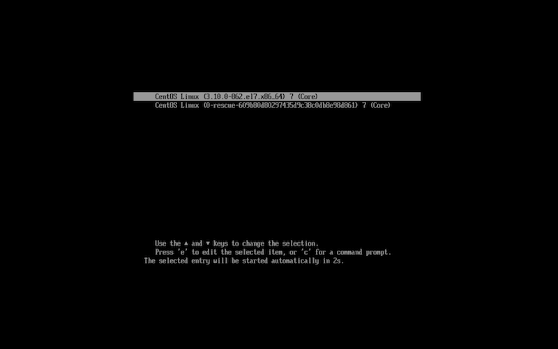

<hr><!-- =============================================================== -->

**Step 20:** Click on "License Information" to accept the CentOS license.
<br>
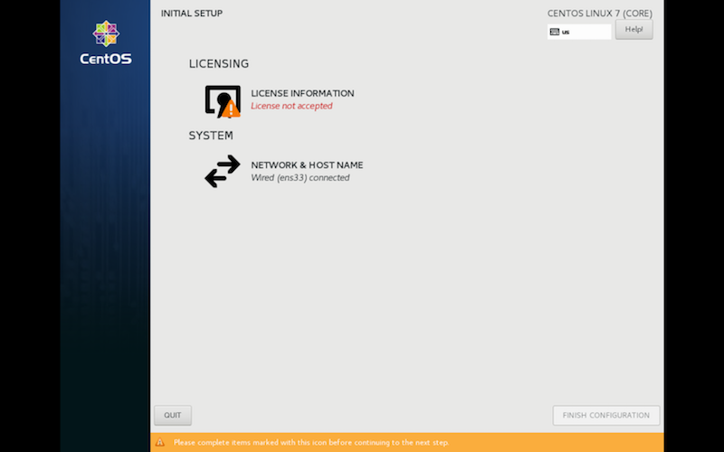

<hr><!-- =============================================================== -->

**Step 21:** Check the box next to "I accept the licnse agreement" to accept
the CentOS license agreement. Then click "Done" in the top left-hand corner.
<br>
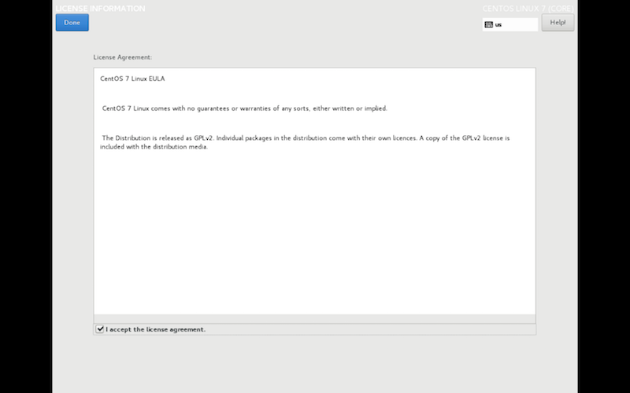

<hr><!-- =============================================================== -->

**Step 22:** Click "Finish Configuration" in the bottom right corner. The
machine will reboot to a logon screen.
<br>
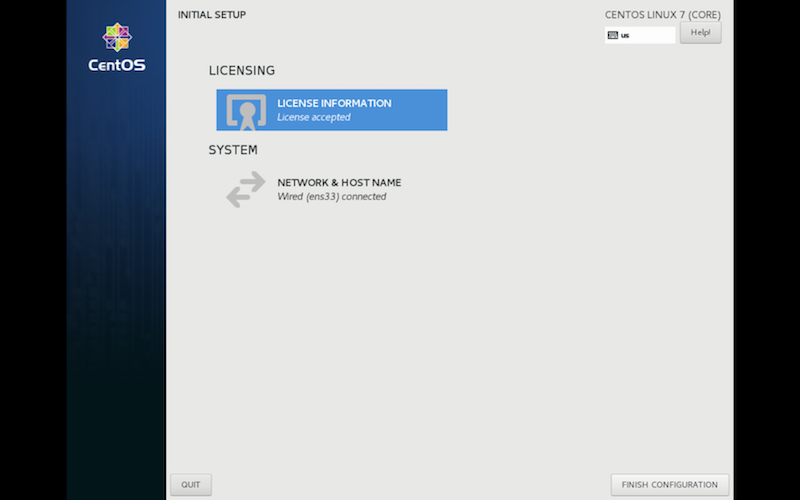

<hr><!-- =============================================================== -->

**Step 23:** Click the username that you previously created.
<br>
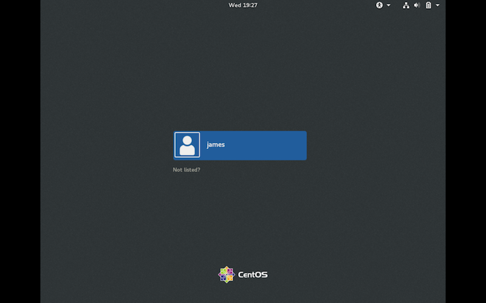

<hr><!-- =============================================================== -->

**Step 24:** Enter the password that you created for the user (not the root password)
and click the "Sign In" button.
<br>


<hr><!-- =============================================================== -->

**Step 25:** Select your language (again) and click "Next".
<br>
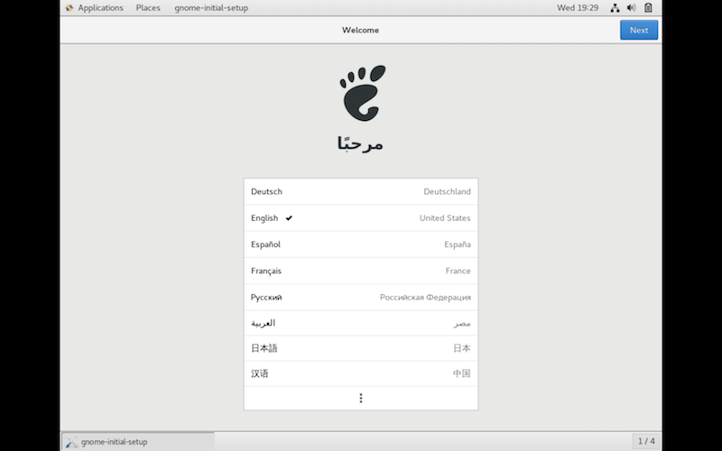

<hr><!-- =============================================================== -->

**Step 26:** Select your keyboard layout and click "Next".

<br>
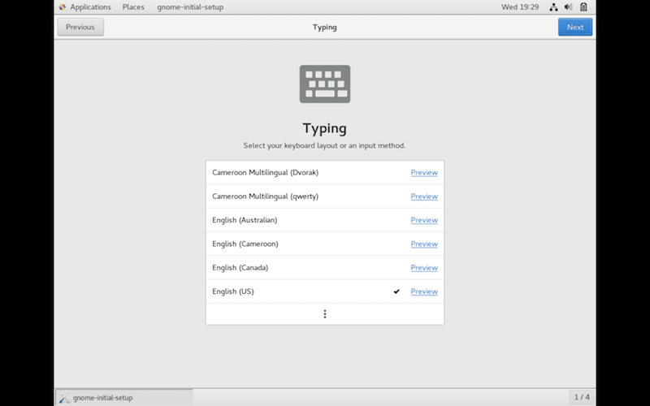

<hr><!-- =============================================================== -->

**Step 27:** Enable or Disable "Location Services", your choice.
<br>
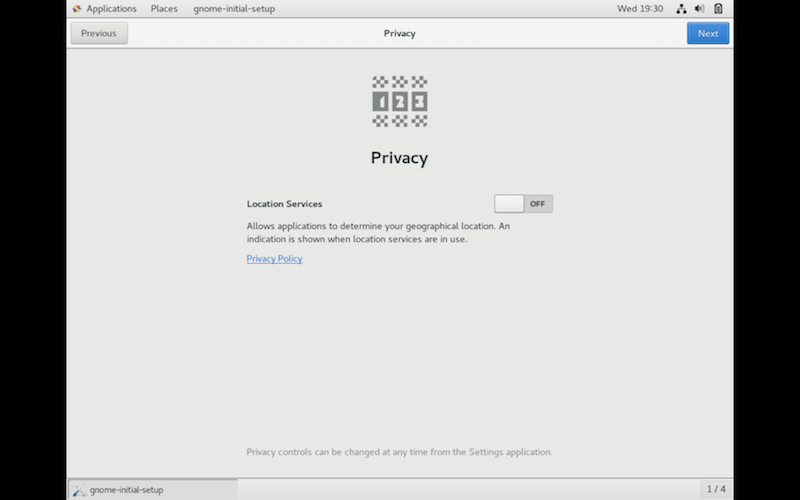

<hr><!-- =============================================================== -->

**Step 28:** If so desired, you can connect your online accounts like your
YCP account.
<br>
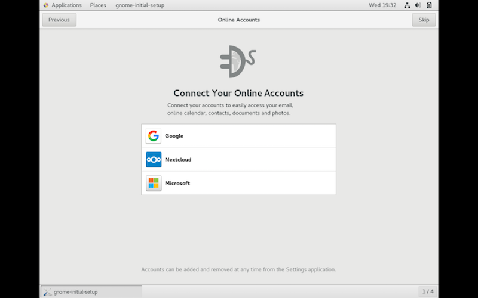

<hr><!-- =============================================================== -->

**Step 29:** You should now be DONE installing CentOS 7.
Click the "Start using CentOS Linux" button to continue.
<br>
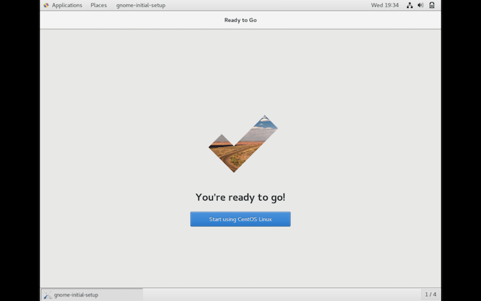

<hr><!-- =============================================================== -->

<hr><!-- =============================================================== -->

<hr><!-- =============================================================== -->


### Installing Development Tools and Clang

**Step 1:** Click the "Applications" menu in the top-left corner, find and run 
the "Terminal" application.
<br>
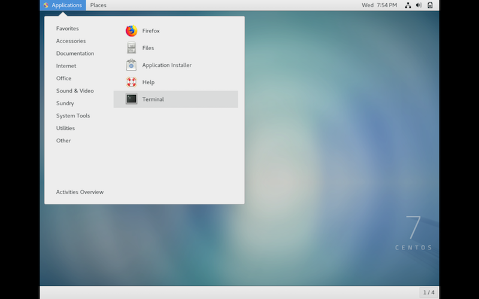

<hr><!-- =============================================================== -->

**Step 2a:** Determine if you already have the development tools installed by typing
```which make```
at the command line and hit enter. If you see the response ```/usr/bin/make``` then
 you already have most of the development tools installed.  Skip down to Step #5.
<br>
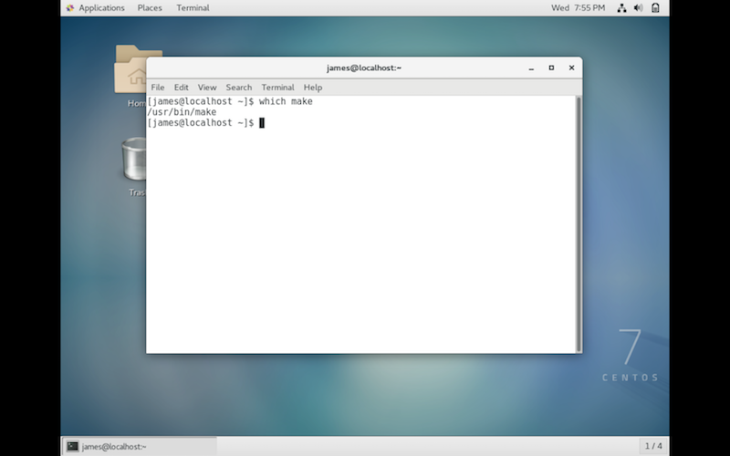

<hr><!-- =============================================================== -->

**Step 2b:** When typing ```which make```, if the response contains 
the phrase ```no make in ...``` and looks like the screenshot below
then you don't have the development tools properly installed. Continue
to Step #3.
<br>
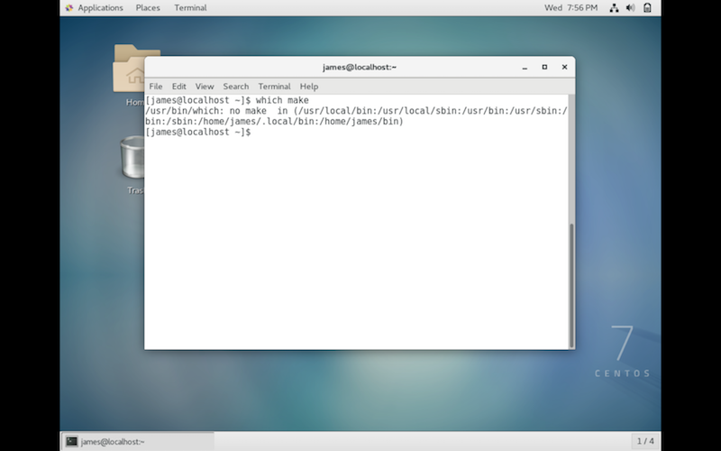

<hr><!-- =============================================================== -->

**Step 3:** In the terminal, type ```su``` to switch users. The ```su``` 
command will make you the root user. Enter the **root password** when prompted.
<br>
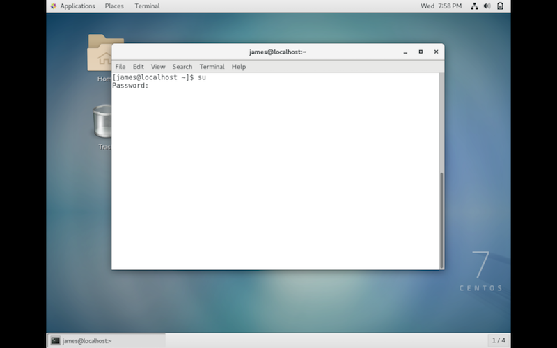

<hr><!-- =============================================================== -->

**Step 4:** As the root user, type the following:
```yum groupinstall development``` and hit enter.
Follow the prompts, enter a ```y``` for "Yes" when required.
When this command completes, the development tools should be 
installed. You can verify success by re-running the command from 
Step 2a.
<br>
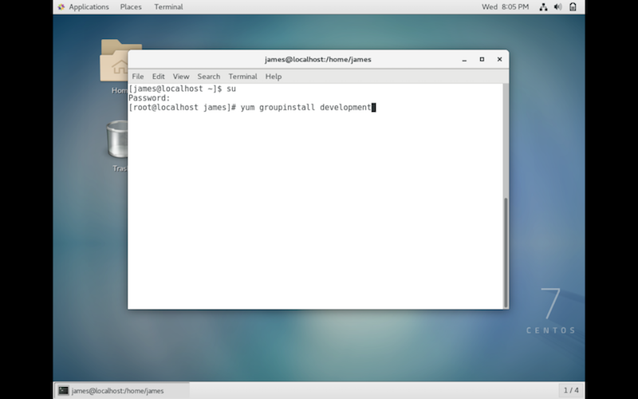

<hr><!-- =============================================================== -->

**Step 5:** Use the terminal to install clang. If you are not 
already the root user, type ```su``` to switch users to the root user.
Enter the **root password** when prompted.
As the root user, type the following to install clang: 
```yum install clang```.
Follow the prompts, enter a ```y``` for "Yes" when required.
When this command completes, clang should be installed.
<br>
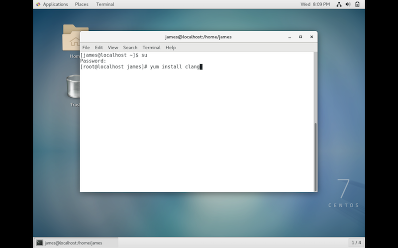


**Step 6:** Use the terminal to install valgrind. If you are not 
already the root user, type ```su``` to switch users to the root user.
Enter the **root password** when prompted.
As the root user, type the following to install valgrind: 
```yum install valgrind```.
Follow the prompts, enter a ```y``` for "Yes" when required.
When this command completes, clang should be installed.
<br>
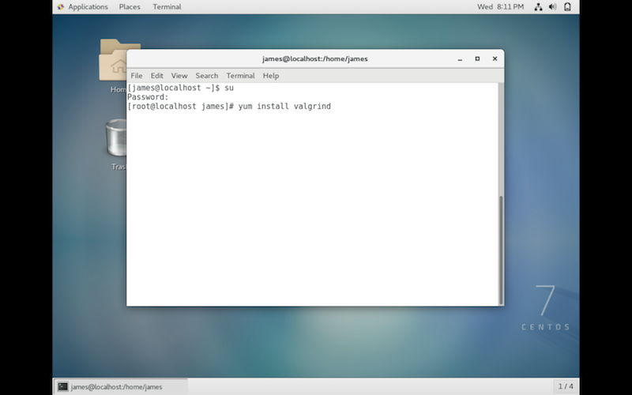


<hr><!-- =============================================================== -->

<hr><!-- =============================================================== -->

<hr><!-- =============================================================== -->


### Installing CLion

**Step 1:** Click the "Applications" menu in the top-left corner, find and run 
the "Firefox" web browser application.
<br>
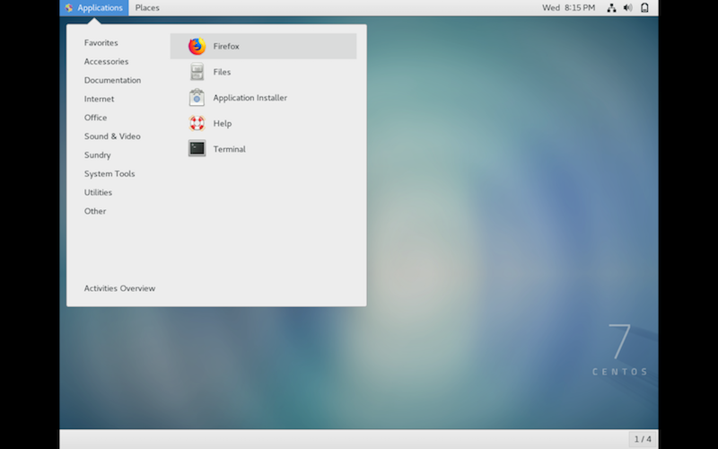

<hr><!-- =============================================================== -->


**Step 2:** Download CLion from the [jetbrains website](https://www.jetbrains.com/clion/download/#section=linux).
It should download into your "Downloads" folder.
<br>
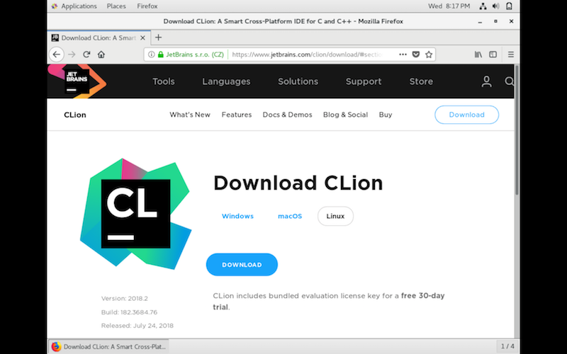

<hr><!-- =============================================================== -->

**Step 3:** Open the Terminal application. Type ```cd Downloads``` to change directories
to your "Downloads" directory.  If you are not already the root user, 
type ```su``` to switch users to the root user.
Enter the **root password** when prompted.
<br>
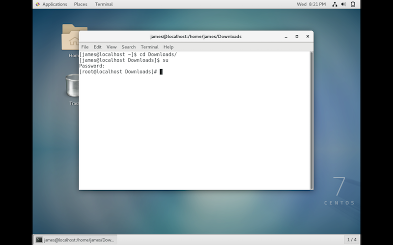

<hr><!-- =============================================================== -->

**Step 4:** As the root user, type the following:
```tar -xzf CLion-2018.2.tar.gz -C /opt```.
This will unpack the compressed ```tar.gz``` file into the ```/opt``` directory.
**Note:** you can speed up the typing of long filenames such 
as ```"CLion-2018.2.tar.gz"``` by typing the first few letters 
(e.g. ```"CL"```) and hitting your ```TAB``` key.
<br>
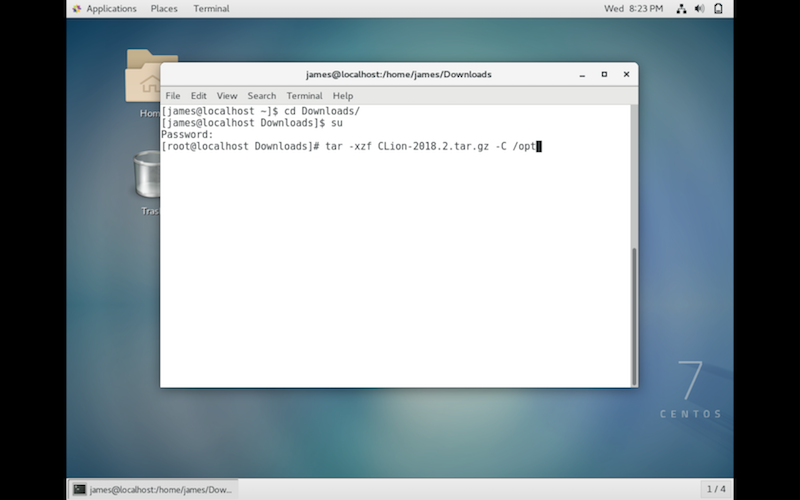

<hr><!-- =============================================================== -->

**Step 5:** Type ```exit``` to logout of the root user account.
<br>


<hr><!-- =============================================================== -->

**Step 6:** Type the following to start CLion for the first time:
```/opt/clion-2017.2.2/bin/clion.sh```.  **Don't forget to use your
```TAB``` key to speed up the typing.***
<br>
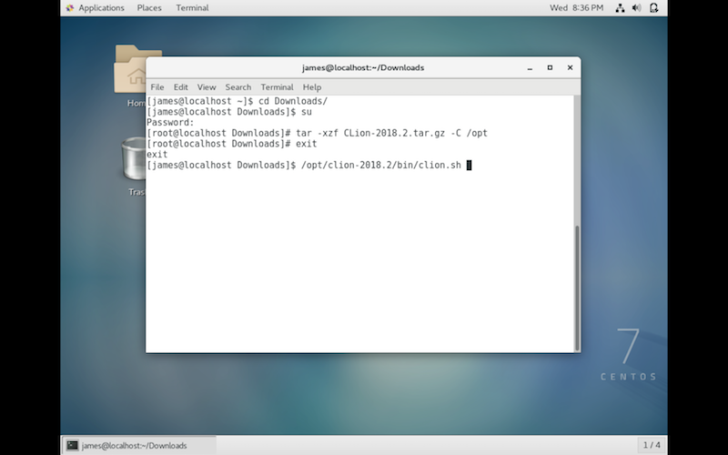

<hr><!-- =============================================================== -->

**Step 7:** Select "Do not import settings" and click "OK".
<br>
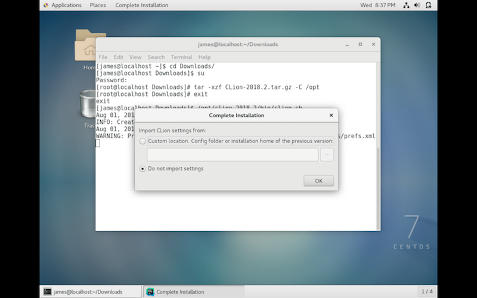

<hr><!-- =============================================================== -->

**Step 8:** Scroll to the end of the CLion User Agreement and click "Accept".
<br>
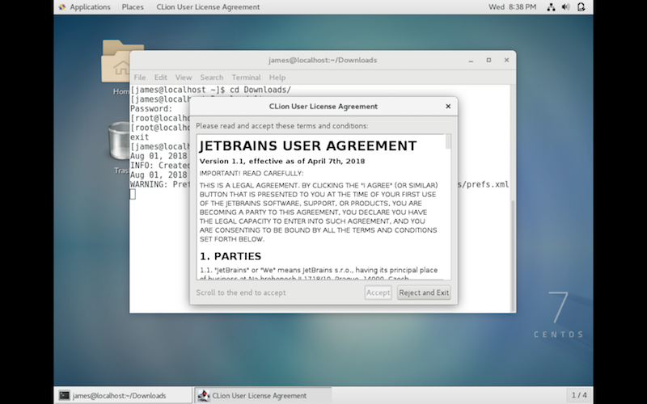

<hr><!-- =============================================================== -->

**Step 9:** If prompted about "Data Sharing", click "Don't Send".
<br>


<hr><!-- =============================================================== -->

**Step 10:** Select a theme and click "Next".
<br>
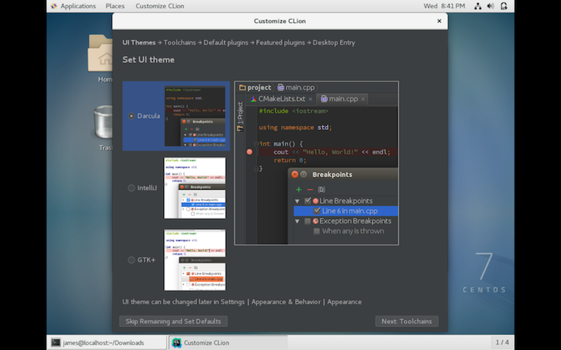

<hr><!-- =============================================================== -->

**Step 11:** Leave these settings at their default values and click "Next".
<br>
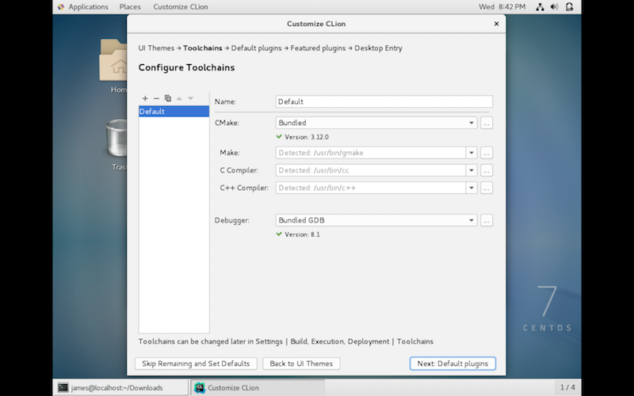

<hr><!-- =============================================================== -->

**Step 12:** Leave these settings at their default values and click "Next".
<br>
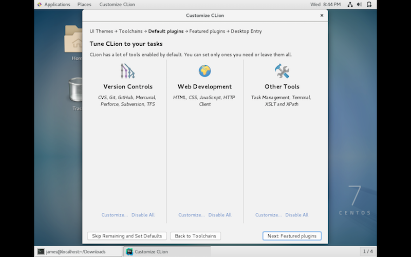

<hr><!-- =============================================================== -->

**Step 13:** Leave these settings at their default values and click "Next".
<br>
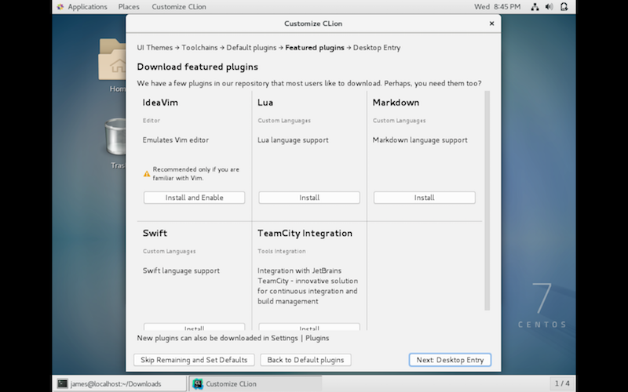

<hr><!-- =============================================================== -->

**Step 14:** Ensure the checkbox labeled "Create a desktop entry ..." is selected.
Click "Start using CLion".
<br>
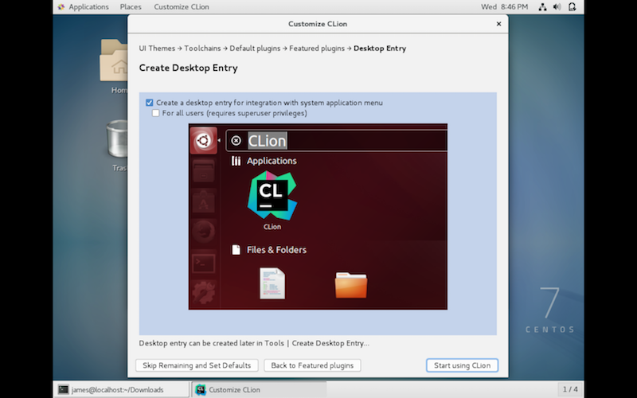

<hr><!-- =============================================================== -->

**Step 15:** Enter the username and password for your free JetBrains
student account. Click "Activate" to continue.  If you don't yet have
your free JetBrains account, visit the []JetBrains student website](https://www.jetbrains.com/student/)
 to create one.  Continue with this step once you've created your account.
<br>
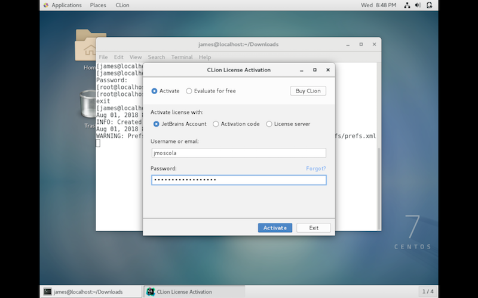

<hr><!-- =============================================================== -->

**Step 16:** Admire your success and click the X to close CLion for now.
<br>
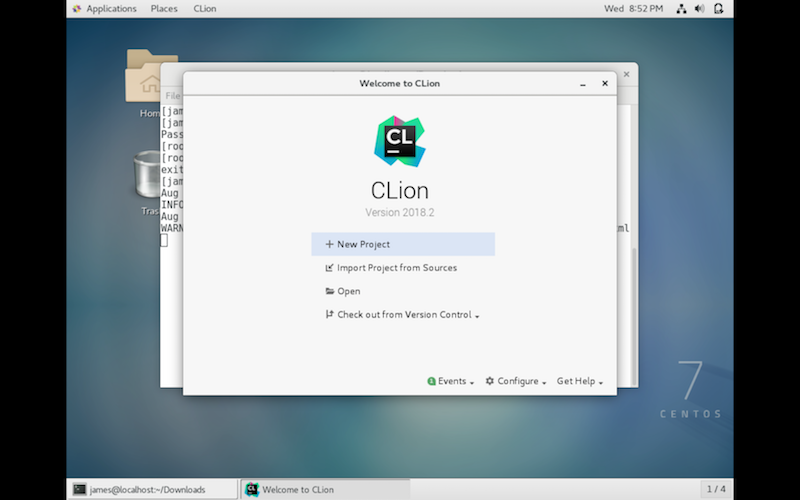

<hr><!-- =============================================================== -->

**Step 17:** Cleanup your "Downloads" by deleting the archive file. 
Type the following:
```rm CLion-2018.2.tar.gz```.  You can close your terminal now.
<br>
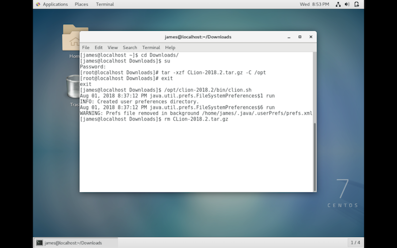

<hr><!-- =============================================================== -->

**Step 18:** From now on, you should be able to start CLion from 
the "Applications --> Programming" menu.
<br>
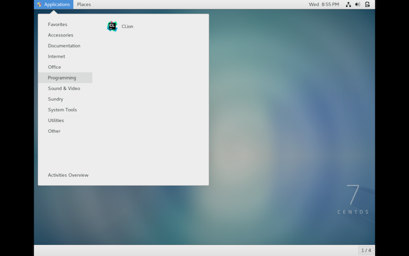

<hr><!-- =============================================================== -->